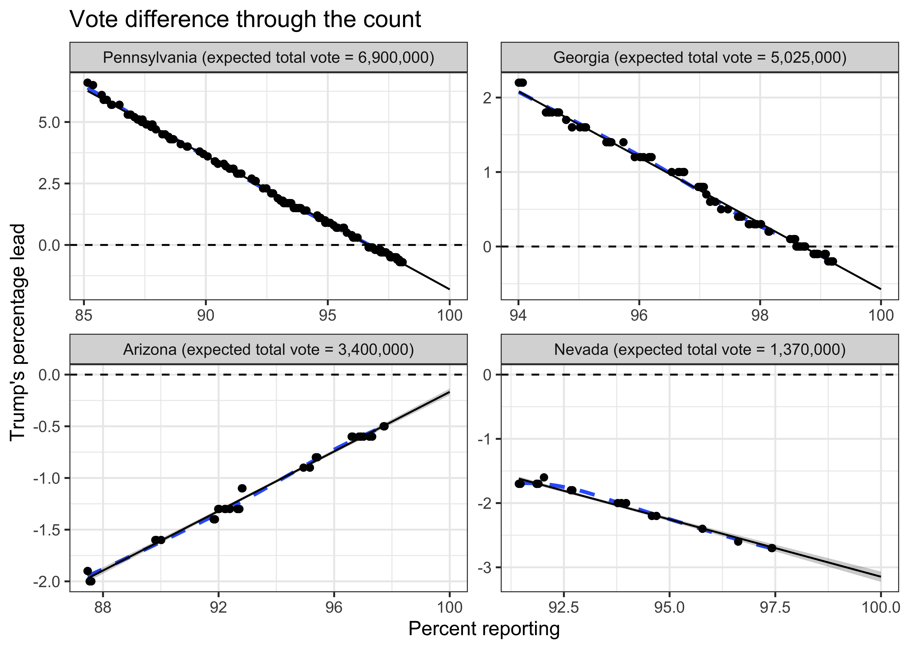

Election Count Predictions
================
Rafael Irizarry
2020-11-09 14:30:51

## Load libraries

``` r
library(tidyverse)
library(jsonlite)
library(scales)
```

## Download and wrangle data and fit linear regression

The following code downloads data from the New York Times API and create
a data frame with the information needed for the plots. Here we fit the
line and obtain standard errors using ordinary least squares.

``` r
states <-c('pennsylvania', 'georgia', 'arizona', 'nevada')
## Define the percent at which the linear trend starts. Used EDA to determine.
starts <- c(85, 94, 87, 90) 

dat <- map_df(seq_along(states), function(i){
  
  url <- paste0("https://static01.nyt.com/elections-assets/2020/data/api/2020-11-03/race-page/",
                states[i],"/president.json")
  raw <- jsonlite::fromJSON(url)
  
  n <- raw$data$races$tot_exp_vote 

  dat <- raw$data$races$timeseries[[1]]$vote_shares%>%
    mutate(Trumps_lead = (trumpd - bidenj)*100,
           pct_reporting = raw$data$races$timeseries[[1]]$votes / n * 100) %>%
    filter(pct_reporting >= starts[[i]])
  
  fit <- lm(Trumps_lead ~ pct_reporting, data = dat)
  
  x <- c(dat$pct_reporting, seq(max(dat$pct_reporting), 100, len = 25))
                
  ## We computer standard errors assuming independence
  ## These data are clearly not independent so the error bars underestimate
  ## Furthermore we think the main source of variability comes from m
  fit <- predict(fit, newdata = data.frame(pct_reporting = x), se.fit = TRUE)
  
  fit_tab <- data.frame(pct_reporting = x, 
                        reg_line = fit$fit, 
                        upper = fit$fit + 1.96 * fit$se,
                        lower = fit$fit - 1.96 * fit$se)
  
  
  dat <- left_join(fit_tab, dat, by = "pct_reporting") %>%
    mutate(state = str_to_title(states[i]), n= n)
  
  dat
})
```

## Make the plot

``` r
dat %>% 
  mutate(state = paste0(state, " (expected total vote = ", prettyNum(n, big.mark = ","), ")")) %>%
  mutate(state = reorder(state, -n, first)) %>%
  ggplot(aes(x = pct_reporting, y = Trumps_lead)) +
  geom_smooth(method = 'loess', formula = "y~x", se=FALSE, lty = 2) + 
  geom_point() +
  geom_ribbon(aes(ymin = lower, ymax = upper), alpha = 0.25) +
  geom_line(aes(y = reg_line)) +
  ggtitle("Vote difference through the count") + 
  xlab("Percent reporting") + ylab("Trump's percentage lead") +
  geom_hline(yintercept = 0, lty = 2) +
  theme_bw() +
  facet_wrap(~state, scales = "free") 
```

<!-- -->

## Latest reported difference and final estimate

``` r
final_estimate <- dat %>% 
  arrange(desc(pct_reporting)) %>%
  group_by(state) %>%
  slice(1) %>%
  ungroup() %>%
  select(state, reg_line) %>%
  mutate(reg_line = format(round(-reg_line, 1), nsmall=1)) %>%
  setNames(c("State", "Final Estiamte"))
last_update <- dat %>% 
  filter(!is.na(Trumps_lead)) %>%
  arrange(desc(pct_reporting)) %>%
  group_by(state) %>%
  slice(1) %>%
  ungroup() %>%
  mutate(Biden_lead = format(-Trumps_lead, nsmall = 1)) %>%
  select(state, Biden_lead) %>%
  setNames(c("State", "Current Biden lead"))
left_join(last_update, final_estimate, by = "State") %>% knitr::kable(align = c("l","r","r"))
```

| State        | Current Biden lead | Final Estiamte |
| :----------- | -----------------: | -------------: |
| Arizona      |                0.5 |            0.2 |
| Georgia      |                0.2 |            0.6 |
| Nevada       |                2.7 |            3.1 |
| Pennsylvania |                0.7 |            1.8 |

## The Math

Why is it a linear trend? The main drive for this is the fact that by
the end of election night most rural in person votes were counted. These
votes went for Trump. Let’s call the difference

*b* = election day votes for Trump - election day votes for Biden

However, in the case of Pennsylvania and Georgia, mail-in votes and some
votes from large metropolitan areas, Philadelphia and Atlanta for
example, were not counted by the end of election night. These votes went
for Biden by a wide margin. Let’s call this difference

*m* = mail in and late metro area votes for Trump - mail in and late
metro area votes for Biden

At the end of the count, the total difference will be: *b + m*

However, during the days after the election we were only seeing a
percent, call it *x*, of the mail in and late metro area votes. So the
observed difference had expected value

*f(x) = b + mx*

As the night progressed, *x* grew and because *m* is negative, the
observed difference *f(x)* decreased linearly, with slope *m*, as the
percent *x* grew. Once *x=1* we will see the final differences *f(1) =
b+m*.

Note that in the case of Arizona, where mail-in vote has always been
popular, *m* was not negative, in fact it was slightly positive.

## Technical notes

  - In each state, the data is not independent because each point is an
    updated percentages not percentages from new votes. As a result the
    standard errors used to construct the confidence intervals are
    underestimated.

  - The main source of variation seems to be the expected total vote,
    which changed throughout the night. Note that when the estimated
    total changes, all the x-values change and the entire plots moves to
    the left or to the right. Only when we are done counting will we
    know what the total vote was.

  - *mx* actually follows a binomial distribution and *f(x) - b* is
    actually its expected value. But because the number of votes being
    considered were very large, the standard error of this random
    variable was negligible.

  - We show the percentages rather than the totals because this is what
    is included in the API. So we are not really seeing *f(x)* but
    *f(x)* divided by the total votes until that moment. Because we are
    almost done counting, this total is not changing much, and the
    linear approximation holds.

## Thanks

  - Rick Paik Schoenberg, for alerting me to the linear pattern.

  - [Andy Jones](https://twitter.com/andy_l_jones), for pointing out the
    API.
